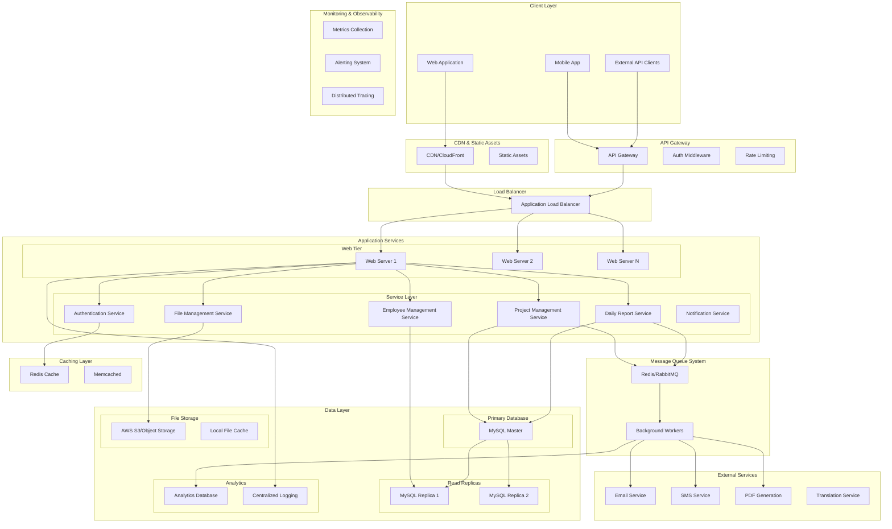

# RDO Construction Management System - Comprehensive Architecture Design

## Executive Summary

The RDO (Relatório Diário de Obra) Construction Management System is a PHP-based construction site management platform focused on daily work reports, employee tracking, and project documentation. This analysis provides a complete architectural redesign to support scalability, maintainability, and modern development practices.

---

## Current System Analysis

### Existing Architecture Pattern
- **Pattern**: MVC with DAO (Data Access Object) pattern
- **Technology Stack**: PHP 7.2+, MySQL, Bootstrap 4.5, jQuery 3.5
- **Authentication**: Custom session-based authentication with security features
- **File Management**: Local file storage with Dropzone integration
- **Dependencies**: Composer-managed with PDF generation and translation services

### Database Schema Analysis
```sql
Core Entities:
- empresa (companies) - id_empresa, nome_fantasia, contratante_sn, url_logo
- obra (projects) - id_obra, fk_id_contratante, fk_id_contratada, descricao_resumo  
- diario_obra (daily reports) - id_diario_obra, numero_diario, fk_id_obra, data
- funcionario (employees) - id_funcionario, fk_id_empresa, nome, cargo
- funcionario_diario_obra (employee daily work) - many-to-many relationship
- imagem (images) - id_imagem, fk_id_diario_obra, url
- servico (services) - id_servico, fk_id_diario_obra, descricao
```

### Strengths
- Clean separation of concerns with DAO pattern
- Comprehensive authentication system with session security
- Well-structured database schema with proper foreign key relationships
- Environment-based configuration system
- Secure password hashing and session management

### Current Limitations
- Monolithic architecture limiting scalability
- No API layer for external integrations
- Local file storage without cloud backup
- Limited caching mechanisms
- No asynchronous processing capabilities
- Frontend tightly coupled with backend

---

## Proposed System Architecture

### High-Level Architecture Diagram



---

## Component Architecture Specifications

### 1. API Gateway Layer

**Purpose**: Single entry point for all API requests with cross-cutting concerns
**Technology**: Nginx/Kong/AWS API Gateway

**Responsibilities**:
- Authentication and authorization
- Rate limiting and throttling
- Request/response transformation
- API versioning management
- CORS handling
- SSL termination

**Configuration Example**:
```yaml
api_gateway:
  rate_limiting:
    requests_per_minute: 1000
    burst_size: 100
  authentication:
    jwt_validation: enabled
    session_validation: enabled
  cors:
    allowed_origins: ["https://app.rdo.com", "https://mobile.rdo.com"]
    allowed_methods: ["GET", "POST", "PUT", "DELETE"]
```

### 2. Service Layer Architecture

#### Authentication Service
**Technology**: PHP 8.1+ with JWT support
**Responsibilities**:
- User authentication and authorization
- JWT token generation and validation
- Session management
- Password policy enforcement
- Multi-factor authentication (future)

```php
interface AuthenticationServiceInterface
{
    public function authenticate(string $username, string $password): AuthResult;
    public function generateJWT(User $user): string;
    public function validateJWT(string $token): bool;
    public function refreshToken(string $refreshToken): string;
}
```

#### Project Management Service
**Technology**: PHP 8.1+ with Domain-Driven Design
**Responsibilities**:
- Project lifecycle management
- Company relationship management
- Project reporting and analytics
- Resource allocation tracking

#### Daily Report Service
**Technology**: PHP 8.1+ with Event Sourcing
**Responsibilities**:
- Daily work report creation and management
- Employee time tracking
- Service logging
- Image attachment handling
- Report validation and approval workflow

#### Employee Management Service
**Technology**: PHP 8.1+ with CQRS pattern
**Responsibilities**:
- Employee profile management
- Company assignment
- Time tracking integration
- Performance reporting

#### File Management Service
**Technology**: PHP 8.1+ with cloud storage integration
**Responsibilities**:
- File upload and storage
- Image processing and thumbnails
- File metadata management
- Access control and permissions

### 3. Data Architecture

#### Database Design
**Primary Database**: MySQL 8.0+ with InnoDB engine
**Read Replicas**: 2+ MySQL instances for read scaling
**Connection Pool**: PHP-FPM with persistent connections

#### Proposed Database Enhancements
```sql
-- Add audit logging
CREATE TABLE audit_log (
    id BIGINT PRIMARY KEY AUTO_INCREMENT,
    table_name VARCHAR(100) NOT NULL,
    record_id INT NOT NULL,
    action ENUM('INSERT', 'UPDATE', 'DELETE'),
    old_values JSON,
    new_values JSON,
    user_id INT,
    ip_address VARCHAR(45),
    created_at TIMESTAMP DEFAULT CURRENT_TIMESTAMP,
    INDEX idx_table_record (table_name, record_id),
    INDEX idx_created_at (created_at)
);

-- Add soft deletes
ALTER TABLE empresa ADD COLUMN deleted_at TIMESTAMP NULL;
ALTER TABLE funcionario ADD COLUMN deleted_at TIMESTAMP NULL;
ALTER TABLE obra ADD COLUMN deleted_at TIMESTAMP NULL;

-- Add performance indexes
CREATE INDEX idx_diario_obra_date ON diario_obra(data);
CREATE INDEX idx_funcionario_empresa ON funcionario(fk_id_empresa);
CREATE INDEX idx_funcionario_diario_composite ON funcionario_diario_obra(fk_id_funcionario, fk_id_diario_obra);
```

#### Caching Strategy
**Redis Configuration**:
```yaml
redis:
  sessions:
    ttl: 7200  # 2 hours
    key_prefix: "rdo:session:"
  
  query_cache:
    ttl: 900   # 15 minutes
    key_prefix: "rdo:query:"
  
  file_metadata:
    ttl: 3600  # 1 hour
    key_prefix: "rdo:file:"
```

### 4. Queue System Architecture

**Technology**: Redis with Laravel Horizon or RabbitMQ
**Queues**:
- `high`: Critical operations (authentication, security)
- `default`: Standard operations (CRUD, file uploads)
- `low`: Background tasks (emails, reports, analytics)

**Job Types**:
```php
// Email notifications
ProcessEmailNotification::dispatch($user, $template, $data);

// PDF generation
GenerateReportPDF::dispatch($reportId, $userId);

// Image processing
ProcessUploadedImage::dispatch($imageId, $options);

// Data synchronization
SyncEmployeeData::dispatch($companyId);
```

---

## API Design Guidelines

### RESTful API Structure
```
Base URL: https://api.rdo.com/v1

Authentication:
POST   /auth/login
POST   /auth/logout  
POST   /auth/refresh
GET    /auth/profile

Projects:
GET    /projects
POST   /projects
GET    /projects/{id}
PUT    /projects/{id}
DELETE /projects/{id}

Daily Reports:
GET    /projects/{id}/reports
POST   /projects/{id}/reports
GET    /reports/{id}
PUT    /reports/{id}
DELETE /reports/{id}

Employees:
GET    /employees
POST   /employees
GET    /employees/{id}
PUT    /employees/{id}
DELETE /employees/{id}

Companies:
GET    /companies
POST   /companies
GET    /companies/{id}
PUT    /companies/{id}
DELETE /companies/{id}
```

### API Response Standards
```json
{
  "success": true,
  "data": {
    "id": 123,
    "attributes": {...},
    "relationships": {...}
  },
  "meta": {
    "timestamp": "2025-01-15T10:30:00Z",
    "version": "v1",
    "request_id": "req_abc123"
  },
  "links": {
    "self": "/api/v1/projects/123",
    "related": "/api/v1/projects/123/reports"
  }
}
```

---

## Migration Roadmap

### Phase 1: Foundation (Months 1-2)
1. **API Layer Development**
   - Create RESTful API endpoints
   - Implement JWT authentication
   - Add API versioning
   - Create comprehensive API documentation

2. **Database Optimization**
   - Add performance indexes
   - Implement audit logging
   - Set up read replicas
   - Add soft deletes

3. **Caching Implementation**
   - Deploy Redis cluster
   - Implement query caching
   - Add session storage in Redis
   - Cache frequently accessed data

### Phase 2: Service Separation (Months 2-4)
1. **Service Extraction**
   - Extract Authentication Service
   - Create Project Management Service  
   - Develop Daily Report Service
   - Build Employee Management Service

2. **Queue System**
   - Deploy message queue system
   - Implement background job processing
   - Add email notification system
   - Create PDF generation workers

3. **File Management**
   - Migrate to cloud storage (S3/equivalent)
   - Implement CDN for static assets
   - Add image processing pipeline
   - Create file access controls

### Phase 3: Scalability (Months 4-6)
1. **Load Balancing**
   - Deploy application load balancer
   - Configure health checks
   - Implement blue-green deployments
   - Add auto-scaling capabilities

2. **Monitoring & Observability**
   - Deploy centralized logging
   - Add performance monitoring
   - Implement alerting system
   - Create dashboards

3. **Security Enhancements**
   - Add API rate limiting
   - Implement Web Application Firewall
   - Add intrusion detection
   - Security audit and penetration testing

---

## Technology Stack Recommendations

### Backend Services
- **Language**: PHP 8.1+ (with FFI for performance-critical operations)
- **Framework**: Slim 4 or Laravel 10 (for API development)
- **Database**: MySQL 8.0+ with InnoDB
- **Caching**: Redis 7.0+
- **Queue**: Redis with Laravel Horizon or RabbitMQ
- **Search**: Elasticsearch (for advanced search features)

### Infrastructure
- **Container**: Docker with Docker Compose
- **Orchestration**: Kubernetes (for production)
- **Web Server**: Nginx with PHP-FPM
- **Load Balancer**: HAProxy or AWS ALB
- **CDN**: CloudFront or Cloudflare
- **Storage**: AWS S3 or compatible object storage

### Monitoring & DevOps
- **Monitoring**: Prometheus + Grafana
- **Logging**: ELK Stack (Elasticsearch, Logstash, Kibana)
- **Tracing**: Jaeger for distributed tracing
- **CI/CD**: GitLab CI or GitHub Actions
- **Infrastructure as Code**: Terraform

### Frontend Modernization (Future)
- **Framework**: Vue.js 3 or React 18
- **State Management**: Vuex/Pinia or Redux
- **UI Library**: Vuetify or Ant Design
- **Build Tool**: Vite
- **Mobile**: PWA or React Native/Flutter

---

## Security Architecture

### Authentication & Authorization
```yaml
security:
  authentication:
    methods: ["jwt", "session"]
    jwt:
      algorithm: "RS256"
      expiration: 3600
      refresh_expiration: 86400
    
    password_policy:
      min_length: 8
      require_uppercase: true
      require_lowercase: true
      require_numbers: true
      require_symbols: true
      
  authorization:
    rbac:
      roles: ["admin", "manager", "supervisor", "worker"]
      permissions: ["read", "write", "delete", "approve"]
    
  rate_limiting:
    login_attempts: 5
    lockout_duration: 900
    api_requests: 1000
    
  encryption:
    data_at_rest: "AES-256"
    data_in_transit: "TLS 1.3"
```

### API Security
- **Authentication**: JWT tokens with RS256 signing
- **Authorization**: Role-based access control (RBAC)
- **Rate Limiting**: Per-user and per-IP limits
- **Input Validation**: Comprehensive input sanitization
- **CORS**: Strict origin validation
- **HTTPS**: Mandatory SSL/TLS encryption

---

## Performance Optimization

### Caching Strategy
1. **Application Level**
   - Redis for session storage
   - Query result caching
   - API response caching

2. **Database Level**
   - Query optimization with proper indexes
   - Read replica for read-heavy operations
   - Connection pooling

3. **Infrastructure Level**
   - CDN for static assets
   - Load balancing across multiple servers
   - Horizontal scaling with container orchestration

### Performance Targets
- **API Response Time**: < 200ms (95th percentile)
- **Page Load Time**: < 2 seconds
- **Database Query Time**: < 100ms (average)
- **File Upload**: Support up to 100MB files
- **Concurrent Users**: Support 1000+ concurrent users

---

## Scalability Considerations

### Horizontal Scaling Strategy
```yaml
scaling:
  web_tier:
    min_instances: 2
    max_instances: 10
    cpu_threshold: 70%
    memory_threshold: 80%
    
  database:
    read_replicas: 2
    write_master: 1
    auto_failover: enabled
    
  storage:
    object_storage: "unlimited"
    cdn_distribution: "global"
    
  queue_workers:
    min_workers: 2
    max_workers: 20
    job_threshold: 100
```

### Database Sharding (Future Consideration)
```sql
-- Potential sharding strategy by company_id
-- Shard 1: company_id % 3 = 0
-- Shard 2: company_id % 3 = 1  
-- Shard 3: company_id % 3 = 2
```

---

## Monitoring and Observability

### Key Metrics to Track
```yaml
application_metrics:
  - name: "api_response_time"
    type: "histogram"
    labels: ["endpoint", "method", "status_code"]
    
  - name: "database_query_duration"
    type: "histogram" 
    labels: ["query_type", "table"]
    
  - name: "cache_hit_ratio"
    type: "gauge"
    labels: ["cache_type"]
    
  - name: "active_users"
    type: "gauge"
    labels: ["user_type"]

infrastructure_metrics:
  - name: "cpu_usage"
    type: "gauge"
    labels: ["instance_id"]
    
  - name: "memory_usage"
    type: "gauge"
    labels: ["instance_id"]
    
  - name: "disk_usage"
    type: "gauge"
    labels: ["instance_id", "mount_point"]
```

### Alerting Rules
```yaml
alerts:
  - name: "HighAPILatency"
    condition: "avg(api_response_time) > 1000ms"
    duration: "5m"
    severity: "warning"
    
  - name: "DatabaseConnectionIssues"
    condition: "mysql_connection_errors > 10"
    duration: "2m"
    severity: "critical"
    
  - name: "HighMemoryUsage"
    condition: "memory_usage > 85%"
    duration: "10m"
    severity: "warning"
```

---

## Implementation Timeline

### Phase 1: API Foundation (Months 1-2)
**Week 1-2**: API Design & Documentation
- Define RESTful API specifications
- Create OpenAPI documentation
- Set up development environment

**Week 3-4**: Authentication Service
- Implement JWT authentication
- Create user management endpoints
- Add role-based access control

**Week 5-6**: Core API Endpoints
- Project management endpoints
- Daily report endpoints
- Employee management endpoints

**Week 7-8**: Database & Caching
- Optimize database schema
- Implement Redis caching
- Set up read replicas

### Phase 2: Service Architecture (Months 2-4)
**Month 2-3**: Service Separation
- Extract authentication service
- Create domain-specific services
- Implement service communication

**Month 3-4**: Queue & Background Processing
- Deploy message queue system
- Implement background workers
- Add notification system

### Phase 3: Production Readiness (Months 4-6)
**Month 4-5**: Infrastructure & Scaling
- Deploy load balancer
- Implement auto-scaling
- Add monitoring and alerting

**Month 5-6**: Security & Performance
- Security audit and hardening
- Performance optimization
- Production deployment

---

## Cost Analysis

### Infrastructure Costs (Monthly Estimate)
```yaml
development_environment:
  servers: $200
  database: $100
  storage: $50
  total: $350

staging_environment:
  servers: $500
  database: $200
  storage: $100
  monitoring: $100
  total: $900

production_environment:
  servers: $1500
  database: $800
  storage: $300
  cdn: $200
  monitoring: $200
  security: $300
  total: $3300
```

### Development Costs
- **Phase 1**: $50,000 - $70,000
- **Phase 2**: $80,000 - $120,000  
- **Phase 3**: $60,000 - $90,000
- **Total**: $190,000 - $280,000

---

## Risk Assessment & Mitigation

### Technical Risks
1. **Data Migration Complexity**
   - Risk: Data loss during migration
   - Mitigation: Comprehensive backup strategy and phased migration

2. **Performance Degradation**
   - Risk: Slower response times during transition
   - Mitigation: Performance testing and gradual rollout

3. **Integration Challenges**
   - Risk: Service integration issues
   - Mitigation: API contracts and comprehensive testing

### Business Risks
1. **Downtime During Migration**
   - Risk: Business disruption
   - Mitigation: Blue-green deployment strategy

2. **User Adoption**
   - Risk: Resistance to new interfaces
   - Mitigation: Phased rollout and user training

3. **Budget Overrun**
   - Risk: Exceeding project budget
   - Mitigation: Agile development with regular reviews

---

## Success Metrics

### Performance Metrics
- API response time: < 200ms (95th percentile)
- System uptime: > 99.9%
- Database query performance: < 100ms average
- File upload success rate: > 99%

### Business Metrics
- User productivity increase: +20%
- Report generation time: -50%
- System maintenance cost: -30%
- New feature deployment time: -60%

### Technical Metrics
- Code coverage: > 80%
- Security vulnerability score: A+
- API documentation coverage: 100%
- Automated test coverage: > 90%

---

## Conclusion

This comprehensive architecture design provides a roadmap for transforming the RDO Construction Management System from a monolithic PHP application into a modern, scalable, microservices-based platform. The proposed architecture maintains compatibility with existing data structures while providing a clear path for future growth and enhancement.

The phased approach ensures minimal disruption to current operations while systematically improving performance, scalability, and maintainability. The emphasis on API-first design enables future mobile applications and third-party integrations, while the robust security and monitoring frameworks ensure enterprise-grade reliability.

Key benefits of this architecture:
- **Scalability**: Handle 10x growth in users and data
- **Performance**: Faster response times and better user experience
- **Security**: Enterprise-grade security with comprehensive audit trails
- **Maintainability**: Clean separation of concerns and modern development practices
- **Future-ready**: API-first design enables mobile and integration capabilities

The estimated 6-month timeline and $190-280k budget provide a realistic path forward for implementing these architectural improvements while maintaining business continuity.