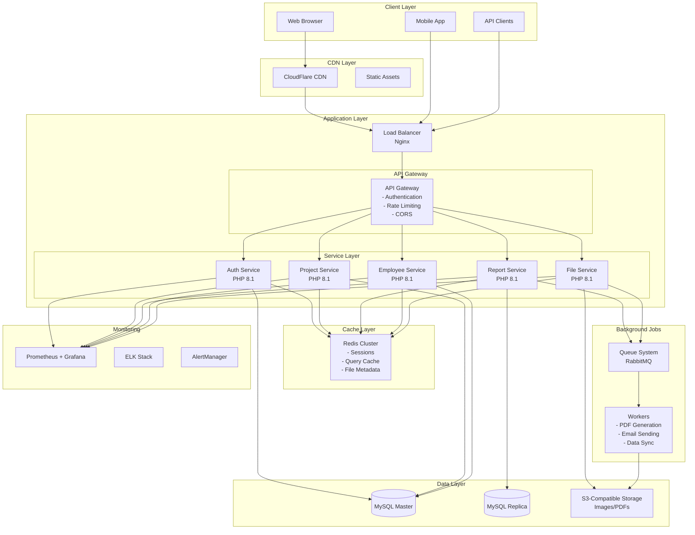
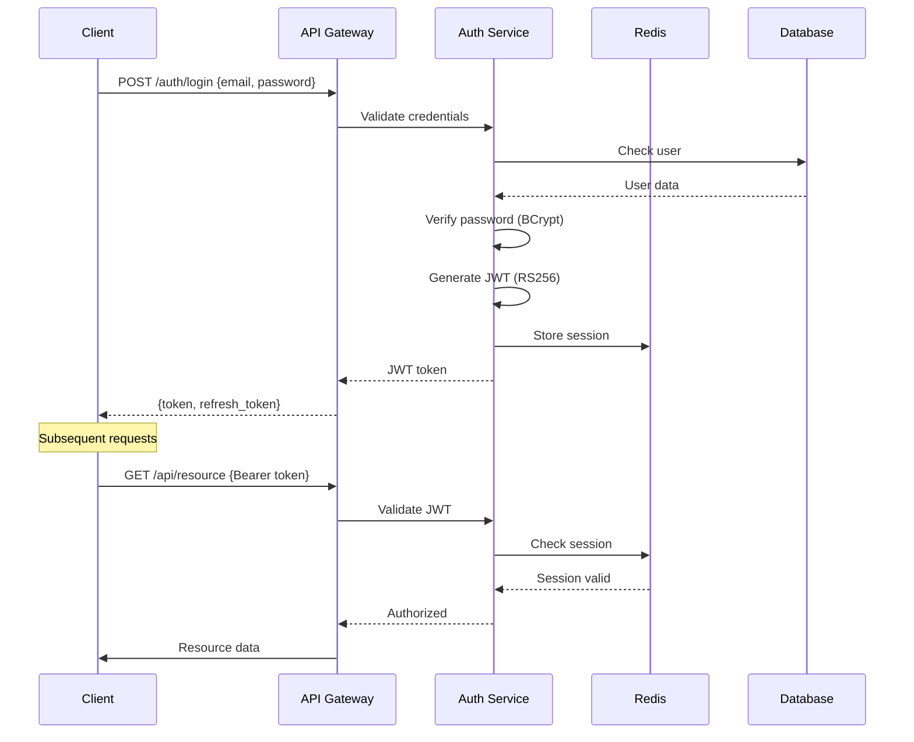

# RDO System Architecture Design

## Executive Summary

Comprehensive system architecture design for the RDO Construction Management System, providing a scalable evolution path from the current monolithic PHP application to a modern service-oriented architecture.

## Current Architecture Analysis

### Existing Structure
- **Type**: Monolithic MVC with DAO Pattern
- **Language**: PHP 7.2+
- **Database**: MySQL/MariaDB
- **Frontend**: Server-side rendered with Bootstrap 4
- **Authentication**: Session-based with Auth class

### Core Components
```
projeto_vetel/
├── models/          # Data models (Empresa, Obra, Funcionario, etc.)
├── auth/           # Authentication system
├── config/         # Environment configuration
├── cadastro*.php   # CRUD controllers
├── lista*.php      # List views
└── vendor/         # Dependencies (PHPSpreadsheet, DomPDF)
```

## Target Architecture Design

### System Architecture Diagram



## Service Architecture

### 1. Authentication Service
```yaml
Service: auth-service
Responsibilities:
  - User authentication (login/logout)
  - JWT token generation and validation
  - Session management
  - Password reset
  - Access control (RBAC)
  
API Endpoints:
  POST   /api/v1/auth/login
  POST   /api/v1/auth/logout
  POST   /api/v1/auth/refresh
  POST   /api/v1/auth/reset-password
  GET    /api/v1/auth/validate
  
Technologies:
  - PHP 8.1 with Slim Framework
  - JWT RS256 signing
  - Redis for session storage
  - BCrypt for password hashing
```

### 2. Project Service
```yaml
Service: project-service
Responsibilities:
  - Company management (Empresa)
  - Project management (Obra)
  - Daily logs (DiarioObra)
  - Service records (Servico)
  
API Endpoints:
  # Companies
  GET    /api/v1/companies
  POST   /api/v1/companies
  GET    /api/v1/companies/{id}
  PUT    /api/v1/companies/{id}
  DELETE /api/v1/companies/{id}
  
  # Projects
  GET    /api/v1/projects
  POST   /api/v1/projects
  GET    /api/v1/projects/{id}
  PUT    /api/v1/projects/{id}
  DELETE /api/v1/projects/{id}
  
  # Daily Logs
  GET    /api/v1/projects/{id}/logs
  POST   /api/v1/projects/{id}/logs
  
Technologies:
  - PHP 8.1 with Slim Framework
  - MySQL with prepared statements
  - Redis for query caching
```

### 3. Report Service
```yaml
Service: report-service
Responsibilities:
  - RDO report generation
  - RDP report generation
  - Excel export
  - PDF generation
  - Analytics dashboard
  
API Endpoints:
  POST   /api/v1/reports/rdo
  POST   /api/v1/reports/rdp
  GET    /api/v1/reports/{id}/status
  GET    /api/v1/reports/{id}/download
  GET    /api/v1/analytics/dashboard
  
Technologies:
  - PHP 8.1 with Slim Framework
  - PHPSpreadsheet for Excel
  - DomPDF for PDF generation
  - RabbitMQ for async processing
  - Redis for caching
```

### 4. Employee Service
```yaml
Service: employee-service
Responsibilities:
  - Employee management (Funcionario)
  - Work assignments (FuncionarioDiarioObra)
  - Time tracking
  - Permission management
  
API Endpoints:
  GET    /api/v1/employees
  POST   /api/v1/employees
  GET    /api/v1/employees/{id}
  PUT    /api/v1/employees/{id}
  DELETE /api/v1/employees/{id}
  GET    /api/v1/employees/{id}/assignments
  POST   /api/v1/employees/{id}/assignments
  
Technologies:
  - PHP 8.1 with Slim Framework
  - MySQL with transactions
  - Redis for caching
```

### 5. File Service
```yaml
Service: file-service
Responsibilities:
  - Image upload/download
  - Logo management
  - Document storage
  - CDN integration
  
API Endpoints:
  POST   /api/v1/files/upload
  GET    /api/v1/files/{id}
  DELETE /api/v1/files/{id}
  GET    /api/v1/files/{id}/metadata
  POST   /api/v1/files/{id}/process
  
Technologies:
  - PHP 8.1 with Slim Framework
  - S3-compatible storage
  - ImageMagick for processing
  - Redis for metadata caching
  - CDN for distribution
```

## Database Architecture

### Schema Design
```sql
-- Read/Write Splitting
-- Master: All writes
-- Replica: All reads for reports and analytics

-- Partitioning Strategy
-- diario_obra: Partition by year
-- funcionario_diario_obra: Partition by year
-- imagem: Archive to S3 after 1 year

-- Indexes Optimization
CREATE INDEX idx_diario_obra_date ON diario_obra(data);
CREATE INDEX idx_obra_contratante ON obra(fk_id_contratante);
CREATE INDEX idx_funcionario_empresa ON funcionario(fk_id_empresa);
CREATE INDEX idx_fdo_composite ON funcionario_diario_obra(fk_id_funcionario, data);
```

### Caching Strategy
```yaml
Cache Layers:
  L1 - Application Cache:
    - PHP OPCache
    - Local memory cache
    
  L2 - Redis Cache:
    - Session data (TTL: 2 hours)
    - Query results (TTL: 5 minutes)
    - API responses (TTL: 1 minute)
    - File metadata (TTL: 1 hour)
    
  L3 - CDN Cache:
    - Static assets (TTL: 30 days)
    - Generated PDFs (TTL: 7 days)
    - Images (TTL: 30 days)
```

## API Design Specifications

### RESTful API Standards
```yaml
Base URL: https://api.rdo-system.com/v1

Headers:
  Authorization: Bearer {jwt_token}
  Content-Type: application/json
  X-Request-ID: {uuid}
  X-API-Version: 1.0

Response Format:
  Success:
    {
      "success": true,
      "data": {},
      "meta": {
        "timestamp": "2025-01-11T12:00:00Z",
        "request_id": "uuid"
      }
    }
    
  Error:
    {
      "success": false,
      "error": {
        "code": "ERROR_CODE",
        "message": "Human readable message",
        "details": {}
      },
      "meta": {
        "timestamp": "2025-01-11T12:00:00Z",
        "request_id": "uuid"
      }
    }

Pagination:
  GET /api/v1/resources?page=1&limit=20&sort=created_at&order=desc
  
  Response:
    {
      "data": [],
      "pagination": {
        "page": 1,
        "limit": 20,
        "total": 100,
        "pages": 5
      }
    }

Rate Limiting:
  - Anonymous: 100 requests/hour
  - Authenticated: 1000 requests/hour
  - Premium: 10000 requests/hour
  
  Headers:
    X-RateLimit-Limit: 1000
    X-RateLimit-Remaining: 999
    X-RateLimit-Reset: 1610000000
```

## Security Architecture

### Authentication Flow


### Security Measures
```yaml
Encryption:
  - At Rest: AES-256-GCM for database
  - In Transit: TLS 1.3 minimum
  - Files: AES-256 for S3 storage
  
Authentication:
  - JWT with RS256 signing
  - Token expiry: 1 hour
  - Refresh token: 7 days
  - Session invalidation on logout
  
Authorization:
  - Role-Based Access Control (RBAC)
  - Resource-level permissions
  - API scope validation
  
Protection:
  - Rate limiting per IP/user
  - DDoS protection (CloudFlare)
  - SQL injection prevention (prepared statements)
  - XSS protection (output encoding)
  - CSRF tokens for state-changing operations
  
Audit:
  - All API calls logged
  - Authentication events tracked
  - Data modification audit trail
  - LGPD/GDPR compliance logging
```

## Scalability Strategy

### Horizontal Scaling
```yaml
Load Balancing:
  - Nginx with round-robin
  - Health checks every 10s
  - Sticky sessions for WebSocket
  
Auto-scaling:
  - CPU threshold: 70%
  - Memory threshold: 80%
  - Request rate: 1000 req/s
  - Scale out: +2 instances
  - Scale in: -1 instance
  - Cool down: 5 minutes
  
Container Orchestration:
  - Kubernetes deployment
  - Docker containers
  - Service mesh (Istio)
  - Rolling updates
  - Blue-green deployments
```

### Performance Targets
```yaml
API Response Times:
  - P50: < 100ms
  - P95: < 200ms
  - P99: < 500ms
  
Throughput:
  - API: 10,000 req/s
  - Database: 5,000 queries/s
  - Cache hit ratio: > 90%
  
Availability:
  - Uptime: 99.9%
  - RTO: < 1 hour
  - RPO: < 5 minutes
  
Capacity:
  - Concurrent users: 1,000+
  - Daily active users: 10,000
  - Data volume: 1TB+
  - File storage: 10TB+
```

## Migration Roadmap

### Phase 1: Foundation (Months 1-2)
```yaml
Tasks:
  - Set up API Gateway
  - Implement JWT authentication
  - Create Auth Service
  - Set up Redis cluster
  - Database read replica
  - Basic monitoring
  
Deliverables:
  - Authentication API
  - Session management
  - Basic API documentation
  - Development environment
```

### Phase 2: Service Migration (Months 2-4)
```yaml
Tasks:
  - Extract Project Service
  - Extract Employee Service
  - Extract Report Service
  - Implement queue system
  - Set up file storage
  - API versioning
  
Deliverables:
  - Core services running
  - Background job processing
  - S3 storage integration
  - API v1 complete
```

### Phase 3: Optimization (Months 4-6)
```yaml
Tasks:
  - Implement caching layers
  - CDN integration
  - Performance tuning
  - Load testing
  - Security hardening
  - Documentation
  
Deliverables:
  - Production-ready system
  - Performance benchmarks
  - Security audit report
  - Complete documentation
```

## Technology Stack

### Backend
```yaml
Language: PHP 8.1+
Framework: Slim 4 (lightweight, PSR-15 compliant)
ORM: Doctrine ORM 2
Queue: RabbitMQ
Cache: Redis 7.0+
Search: Elasticsearch (future)
```

### Database
```yaml
Primary: MySQL 8.0+
Cache: Redis 7.0+
Time-series: InfluxDB (metrics)
Document: MongoDB (logs, future)
```

### Infrastructure
```yaml
Container: Docker
Orchestration: Kubernetes
Service Mesh: Istio
API Gateway: Kong
Load Balancer: Nginx
CDN: CloudFlare
Storage: S3-compatible (MinIO/AWS)
```

### Monitoring
```yaml
Metrics: Prometheus + Grafana
Logs: ELK Stack (Elasticsearch, Logstash, Kibana)
APM: New Relic or DataDog
Alerts: AlertManager + PagerDuty
Tracing: Jaeger
```

## Cost Analysis

### Development Costs
```yaml
Team:
  - 2 Senior Backend Developers: 6 months
  - 1 DevOps Engineer: 6 months
  - 1 Frontend Developer: 3 months
  - 1 QA Engineer: 3 months
  
Estimated Total: $190,000 - $280,000
```

### Infrastructure Costs (Monthly)
```yaml
Production:
  - Kubernetes Cluster (3 nodes): $450
  - MySQL RDS: $200
  - Redis Cluster: $150
  - S3 Storage (1TB): $100
  - CDN: $200
  - Monitoring: $300
  - Load Balancer: $100
  
Total Monthly: ~$1,500

Scaling (1000+ users):
  - Kubernetes Cluster (6 nodes): $900
  - MySQL RDS (Multi-AZ): $600
  - Redis Cluster (HA): $400
  - S3 Storage (10TB): $300
  - CDN: $500
  - Monitoring: $600
  
Total Monthly: ~$3,300
```

## Risk Assessment

### Technical Risks
```yaml
High Risk:
  - Data migration complexity
  - Service extraction challenges
  - Performance degradation during migration
  
Mitigation:
  - Incremental migration approach
  - Comprehensive testing
  - Rollback procedures
  - Feature flags
  
Medium Risk:
  - Team learning curve
  - Integration complexity
  - Third-party dependencies
  
Mitigation:
  - Training and documentation
  - Proof of concepts
  - Vendor evaluation
```

## Success Metrics

### KPIs
```yaml
Performance:
  - API response time < 200ms (P95)
  - System uptime > 99.9%
  - Cache hit ratio > 90%
  
Business:
  - User satisfaction > 4.5/5
  - Support tickets < 10/month
  - Data processing time -50%
  
Technical:
  - Test coverage > 80%
  - Code quality score > B
  - Security vulnerabilities: 0 critical
```

## Conclusion

This architecture design provides a clear evolution path from the current monolithic PHP application to a modern, scalable service-oriented architecture. The phased approach ensures business continuity while systematically improving performance, security, and maintainability.

### Next Steps
1. Review and approve architecture design
2. Set up development environment
3. Begin Phase 1 implementation
4. Establish monitoring and metrics
5. Create detailed API documentation

---

*Document Version: 1.0*  
*Date: January 2025*  
*Status: Ready for Review*